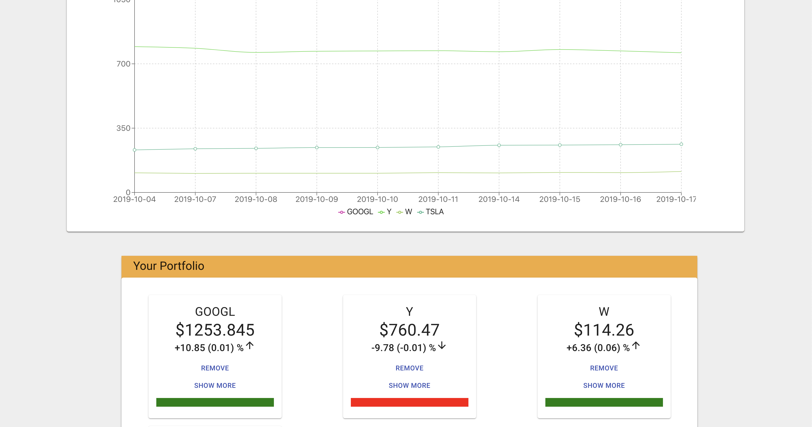
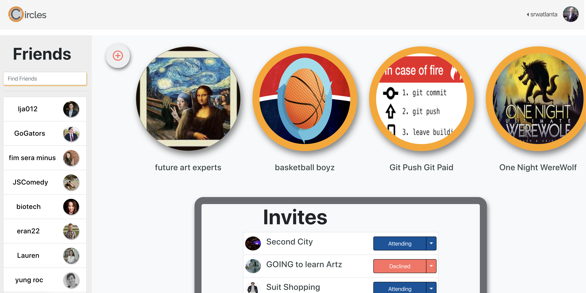

<!DOCTYPE html>
<html lang="en" dir="ltr">

<head>
  <meta charset="utf-8">
  <title>Shawn Wheeler</title>
  <link rel="stylesheet" href="css/styles.css">
  <link rel="icon" href="favicon.ico">
  <link href="https://fonts.googleapis.com/css?family=Merriweather|Montserrat|Sacramento" rel="stylesheet">
</head>

<body>
  

    
    <h1>I'm Shawn.</h1>
    <h2 class="subtitle">a programmer.</h2>
    
    
  

  

    

      
      <h2>Hello.</h2>
      
I am a software engineer with a successful history in leadership positions and a passion for problem solving.

    

    

    

      <h2>My Skills.</h2>
      

        
        <h3>Engineer</h3>
        
Recently graduated from Flatiron Chicago's software programming bootcamp and completed the AppBrewery Complete Web Development Bootcamp.

      

      

        
        <h3>Leadership</h3>
        
Have worked in retail leadership for over 12 years for companies such as Fendi, Jimmy Choo, SuitSupply, Jason's Deli, Kroger and Planet Blue. Assistant Coach to the Men's USA Dodgeball Team.

      

      

        
        <h3>Analytics</h3>
        
I love to problem solve. Finding solutions to qualitative problems was one of my focal points as a retail manager. Assessing efficiency and creating gameplans based on quantitaive results is my main goal as a dodgeball coach.

      

    

    

      <h2 class="touch">My Projects.</h2>
      

        <a href='https://tickr-stock.herokuapp.com/login'>
        <h4>Tickr</h4>
        </img>
        </a>
        
Personalized stock portfolio app to discover new equities and track users’ stock news and price fluctuations in real time.

      

      

        <a href="https://circles-frontend.herokuapp.com/login"> 
          <h4>Circles</h4>   
          </img>
        </a>    
        
Social networking app with a focus on event creation, promotion, and management for users with related interests.

      

    

    

    

      <h2 class="touch">Get In Touch</h2>
      <h3>If you like talking about coding or dodgeball</h3>
      

        Or poetry or art or how nice it is to lie on fur rugs
      

      <a class="btn" href="mailto:shawnrwheeler@gmail.com">EMAIL ME</a>
    

  

  

    <a class="footer-link" href="https://www.linkedin.com/in/shawn-wheeler/">LinkedIn</a>
    <a class="footer-link" href="http://github.com/srwatlanta">Github</a>
    
© 2019 Shawn Wheeler

  

</body>

</html>
